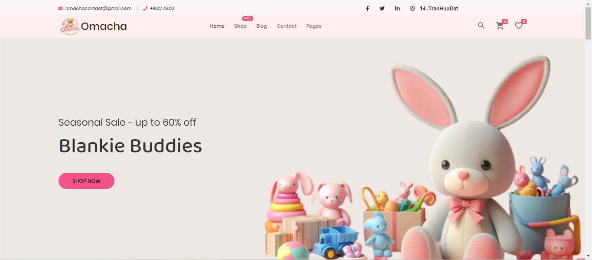

# Omacha Shop - E-commerce Toy Store

 <!-- MAKE SURE THIS IMAGE EXISTS OR REPLACE IT -->

Welcome to Omacha Shop, a delightful e-commerce platform dedicated to bringing joy and quality toys to children and families. This project showcases a full-stack web application built with PHP, designed for use with XAMPP, and features a comprehensive set of functionalities for both customers and administrators.

## 🌟 Project Overview

Omacha Shop is designed to provide a seamless and enjoyable online shopping experience for toy enthusiasts. From browsing a diverse collection of toys to secure (simulated) payment and order tracking, Omacha aims to be a trusted destination for parents and children alike. The platform also includes a robust administration system for efficient business management.

**Live Demo:** 
Customer: [https://tranhuudatlego.github.io/Frontend/] 
Admin: [https://tranhuudatlego.github.io/Admin/]
## ✨ Key Features

### For Customers:
*   **Intuitive Product Browsing:**
    *   Homepage with featured products, new arrivals, and shop by category/age.
    *   Advanced search functionality.
    *   Product listing page with filtering options (price, type, tags).
    *   Detailed product pages with multiple screenshot, descriptions, additional information, and customer reviews.
*   **Shopping Cart & Wishlist:**
    *   Add to cart functionality.
    *   Side cart preview.
    *   Dedicated cart page with quantity updates, coupon application.
    *   Wishlist feature to save favorite items.
*   **Secure Checkout Process:**
    *   Clear checkout steps.
    *   Shipping information and calculation (placeholder for actual shipping methods).
    *   Order summary and "Thank You" page upon successful purchase.
    *   Invoice generation (PDF export option).
*   **User Accounts:**
    *   Customer registration and login.
    *   (Potentially) Order history and profile management.
*   **Engagement & Information:**
    *   **Blog Section:** Articles related to toys, child development, and parenting.
    *   **About Us Page:** Sharing the store's story, mission, and team.
    *   **Contact Page:** With a contact form and location map.
    *   Product reviews and ratings.
    *   Comment system on blog posts with admin reply functionality.

### 🛍️ Customer Interface
| Home Page (Layout 1)                   | Product Listing (with Filter)          | Product Detail Page                    |
| :------------------------------------: | :------------------------------------: | :------------------------------------: |
|  |  |  |
| **Shopping Cart**                      | **Checkout Process**                   | **Thank You Page**                     |
|  |  |  |
| **Login Page**                         | **Registration Page**                  | **Wishlist Page**                      |
|  |  |  |
| **Blog Page**                          | **About Us Page**                      | **Contact Page**                       |
|  |  |  |
| **Invoice / Order Detail**             | **Search Results**                     | **Comment Section** (e.g., on Product)|
|  |  |  |
| **Home Page (Layout 2 - if any)**      | **Home Page (Layout 3 - if any)**      | **Home Page (Layout 4 - if any)**      |
|  |  |  |
| **Home Page (Layout 5 - if any)**      |                                        |                                        |
|  |                                        |                                        |

### For Administrators (Admin Dashboard):
*   **Dashboard Overview:** Quick statistics on total orders, users, new sales, pending comments.
*   **User Management:** View and manage registered users.
*   **Product Management:**
    *   Add new products with details like name, image, price, type, age, provider.
    *   View, edit, and delete existing products.
*   **Order Management:** View and manage customer orders.
*   **Comment Management:** View, approve, and reply to comments on blog posts or products.
*   **Content Management (Implicit):** Managing blog posts, categories, etc.
*   **Statistical Reports:** Visual charts for best sellers, revenue over time.

### ⚙️ Admin Interface
| Admin Login Page                       | Admin Signup Page (if applicable)      | Admin Dashboard                        |
| :------------------------------------: | :------------------------------------: | :------------------------------------: |
|  |  |  |
| **Add Product Form**                   | **Manage Products (List)**             | **Manage Orders (List)**               |
|  |  |  |
| **Manage Users (List)**                |                                        |                                        |
|  |                                        |                                        |

## 🛠️ Technology Stack

*   **Frontend:**
    *   HTML5
    *   CSS3
    *   JavaScript
    *   Bootstrap (Likely, based on UI elements)
    *   Tailwind 
*   **Backend:**
    *   PHP (Procedural or with a custom structure)
*   **Database:**
    *   MySQL (Managed via phpMyAdmin in XAMPP)
*   **Web Server:**
    *   Apache (via XAMPP)
*   **Admin Dashboard Template (if used):**
    *   [Name of the admin template, e.g., SB Admin, AdminLTE, or custom built]
*   **Other Tools/Libraries:**
    *   [Any specific PHP libraries for charts, PDF generation, image handling, etc.]

## 🚀 Getting Started

### Prerequisites

*   **XAMPP:** Download and install XAMPP (includes Apache, PHP, MySQL/MariaDB, phpMyAdmin) from [Apache Friends](https://www.apachefriends.org/index.html).
*   **Git:** For cloning the repository.

### Installation & Setup

1.  **Start XAMPP:**
    *   Open the XAMPP Control Panel.
    *   Start the **Apache** and **MySQL** services.

2.  **Clone the repository:**
    *   Open your command line/terminal.
    *   Navigate to the `htdocs` directory inside your XAMPP installation folder (e.g., `C:\xampp\htdocs` on Windows, or `/Applications/XAMPP/htdocs` on macOS).
    *   Clone the project:
        ```bash
        git clone https://github.com/[Your_Username]/OmachaShop.git
        cd OmachaShop
        ```
        *(Replace `[Your_Username]` with your actual GitHub username if you've forked it, or use the original repository URL.)*
        The project should now be in a folder like `C:\xampp\htdocs\OmachaShop`.

3.  **Database Setup:**
    *   Open your web browser and go to `http://localhost/phpmyadmin`.
    *   Create a new database:
        *   Click on "New" on the left sidebar.
        *   Enter the database name as `toy-shop`.
        *   Choose a collation (e.g., `utf8mb4_general_ci`) and click "Create".
    *   Import the SQL file:
        *   Select the newly created `toy-shop` database from the left sidebar.
        *   Click on the "Import" tab at the top.
        *   Click "Choose File" and navigate to the `OmachaShop/Frontend/` directory (or wherever `toy-shop.sql` is located within your project structure) and select the `toy-shop.sql` file.
        *   Scroll down and click "Go".

4.  **Configure Database Connection (if necessary):**
    *   Your PHP application will need to connect to the database. Locate the PHP file(s) in your project that handle database connections (e.g., `config.php`, `db_connect.php`, or similar).
    *   Ensure the connection details are correct for a default XAMPP setup:
        *   Hostname: `localhost`
        *   Database Name: `toy-shop`
        *   Username: `root`
        *   Password: `(empty by default)`
    *   *(If your connection file is structured differently, adjust accordingly.)*

5.  **Accessing the Application:**
    *   **Customer Site:** Open your browser and go to `http://localhost/OmachaShop/` (or `http://localhost/YourProjectFolderName/` if you named the folder differently in `htdocs`).
    *   **Admin Panel:** Access via `http://localhost/OmachaShop/admin/` (or the specific path to your admin area, e.g., `admin.php`, `admin_login.php`).
        *   Default admin credentials (if any, please specify): `Username: [admin_user]`, `Password: [admin_pass]` *(Update these if you have default credentials)*

## 🤝 Contributing

Contributions are welcome! If you have suggestions or improvements, please feel free to:
1.  Fork the Project
2.  Create your Feature Branch (`git checkout -b feature/AmazingFeature`)
3.  Commit your Changes (`git commit -m 'Add some AmazingFeature'`)
4.  Push to the Branch (`git push origin feature/AmazingFeature`)
5.  Open a Pull Request

## 📝 License

This project is licensed under the [Your_License_Name, e.g., MIT License] - see the `LICENSE.md` file for details (if you have one). *(Consider adding an MIT License file if it's open source)*

## 👤 Author

*   **[Team Engineering]**
    *   **Trần Hữu Đạt** - Full-Stack Developer - [@TranHuuDat2004](https://github.com/TranHuuDat2004)
    *   **Nguyễn Thùy Khanh** - Leader
    *   **Trần Bình Quyên** - Marketing Manager
    *   **Dương Thị Thùy Linh** - Product Manager


## 🙏 Acknowledgments

*   [Any third-party libraries, APIs, or inspirations you'd like to acknowledge]
*   [The source of the original template if you used one for the frontend/admin]
*   Thanks to all team members for their collaboration!
